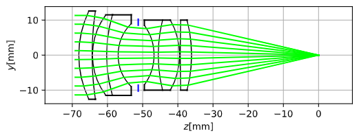

# raytracing-for-lens

This is reference implementation of my blog post [写真レンズのレイトレーシング(RayTracing of Photographic Lens)](https://yumcyawiz.github.io/teastat/2020/09/01/raytracing-for-lens/)

## Gallery

### Optical Path Diagram

### Spherical Aberration Plot

See  `main.ipynb`.