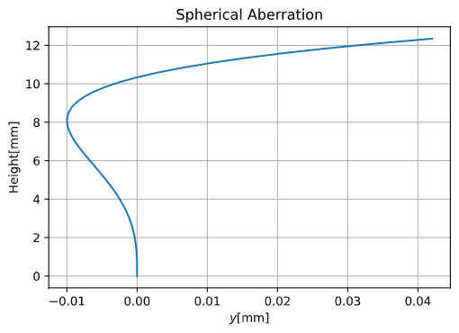

# raytracing-for-lens

This is reference implementation of my blog post [写真レンズのレイトレーシング(RayTracing of Photographic Lens)]()

## Gallery

### Optical Path Diagram

### Spherical Aberration Plot

See  `main.ipynb`.